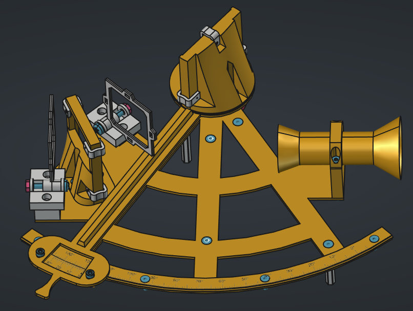

# 3D-Printed Sextant

## What is a sextant?
A sextant is a navigational instrument used for measuring
the angular distances between two objects, such as the 
horizon and a celestial body like the sun or a star. Using
these angles, navigators can determine their latitude 
and longitude. The accuracy and portability of the sextant
made it an essential tool for ocean navigation in the age of 
sail. Nowadays sextants are mostly used by hobbyists and as
a reliable backup to modern GPS technology.

## This Project

After being caught in a rabbit hole of astronavigation, I 
wanted to experiment with navigation using sextants. 
Unfortunately, I quickly found  out that these devices are 
really expensive, and I didn't want to spend hundreds of 
dollars on my first sextant. That is why I decided to build 
my own, using 3D printing technology. The main focus of this 
project is to create a very cheap sextant that can be used 
by everyone who wants to experiment with astronavigation. I 
will try to make the device as accurate as possible, with a 
theoretical accuracy of around 1/6th of a degree or 10 nautical 
miles. For more accurate measurements, different techniques 
and materials are probably needed. The design will be 
modular, so everyone can change it to fit their needs.

## Building your own
### What do you need?
You will need the following materials:

| Amount | Description |
| - | - |
| 10 | M3x10 Bolt (flat head) |
| 3 | M3x8 Bolt (countersunk head) |
| 6 | M3x10 Bolt (countersunk head) |
| 15 | M3 Hex Nut |
| 1 | M3x16 Bolt (countersunk head) |
| 2 | M4x20 Bolt (flat head) |
| 2 | M4 Hex Nut |
| 4 | M3x5 Bolt (countersunk) |
| 4 | M3x35 Hex standoff |
| 2 | Mirror 50x40x3mm |
| 1 | 608-ZZ Ball Bearing |
|  | Filament |
